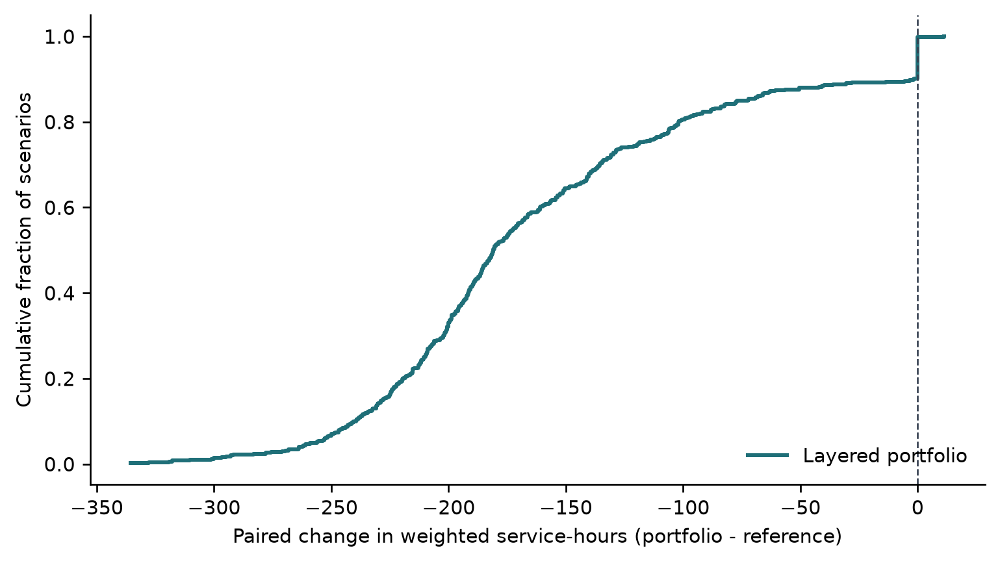

# Modeling hospital service disruption during ransomware

We started this project with a question that sounded simple: if the same synthetic hospital network is exposed to the same ransomware-like event, how much difference does a layered set of defenses make?

The answer turned out to be less simple than the first results suggested.

Our model compares a flat reference configuration with a layered portfolio that combines basic segmentation, faster detection and isolation, and protected backups. In a fresh bank of 500 paired scenarios, the layered portfolio produced less modeled service disruption in 451 cases, tied in 48, and performed worse in one. The mean fell from 193.4 to 33.9 weighted service-hours lost.

That is the encouraging part. The important warning is that the size of the benefit changed when we shortened the simulation time step. The direction survived every joint stress setting we tested; the percentage reduction did not. This repository includes that failed numerical check because it changed what we believe the study can honestly claim.




## What is being modeled

The simulator generates a directed network of synthetic hospital assets across functions such as workstations, clinical applications, identity, medical devices, administration, vendor access, and backup systems. A node can move through healthy, compromised, detected, isolated, restoring, and restored states.

We measure disruption as service-hours lost across seven modeled services:

- electronic health record
- laboratory
- pharmacy
- imaging
- scheduling
- identity
- backup and recovery


## Repository guide

| Path | Contents |
|---|---|
| [`src/grrc`](src/grrc) | Simulator and analysis package |
| [`tests`](tests) | Unit, invariant, paired-design, and behavioral tests |
| [`configs`](configs) | Frozen configurations for the public-evidence and five-minute studies |
| [`study`](study) | Protocols, parameter register, and retained deviations |
| [`data/public_validation`](data/public_validation) | Fifteen-minute validation data and corrected diagnostics |
| [`data/fine_step_replication`](data/fine_step_replication) | Frozen five-minute primary and joint-stress data |
| [`results`](results) | Compact result summaries and figures |
| [`docs/manuscript`](docs/manuscript) | Compiled paper, editable LaTeX, bibliography, and figures |
| [`docs/evidence`](docs/evidence) | Source map, literature-search record, and assumption audit |

## Run the checks

Python 3.12 or newer is required.

```bash
python -m venv .venv

# Windows
.venv\Scripts\activate

# macOS or Linux
source .venv/bin/activate

pip install -r requirements.txt
pip install -e .
pytest
python -m grrc.cli validate --no-report
```

The expected result is **56 passing tests** and **12/12 behavioral validation checks**.

## Reproduce the fresh studies

The full study takes considerably longer than the test suite. The configurations, seeds, raw outputs, and processed summaries are already committed so the reported values can be audited without rerunning thousands of simulations.

```bash
# Frozen five-minute replication
python scripts/run_fine_step_replication.py
python scripts/analyze_fine_step_replication.py

# Public-evidence validation and diagnostics
python scripts/run_public_validation.py
python scripts/analyze_public_validation.py

# Independently reconstruct exported metrics
python scripts/audit_derived_metrics.py \
  --raw-dir data/fine_step_replication/raw \
  --output data/fine_step_replication/processed/derived_metric_audit.csv
```

Before rerunning a frozen study, read the matching protocol and [`study/DEVIATIONS.md`](study/DEVIATIONS.md). Do not overwrite retained diagnostic files or combine development, corrected, and replication results.

## Manuscript

- [Read the current PDF](docs/manuscript/main.pdf)
- [Edit the LaTeX source](docs/manuscript/main.tex)
- [Review the bibliography](docs/manuscript/references.bib)
- [Read the originality and author-voice audit](docs/manuscript/ORIGINALITY_AND_VOICE_AUDIT.md)

## AI use

Claude, and Codex were used for code suggestions, debugging, organization, and language revision. Their output was not used as evidence. Numerical claims were regenerated from code and CSV files, and literature claims were checked against the cited sources. The authors remain responsible for understanding the model, approving the text, and correcting errors.

