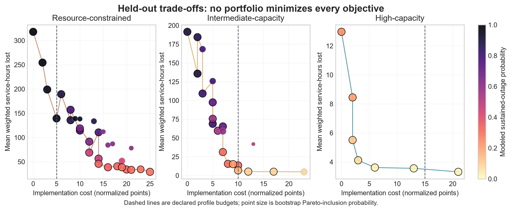

# Multi-objective hospital ransomware defense portfolios

This repository asks a decision question: which synthetic defense portfolios remain efficient when average disruption, tail disruption, sustained outage, recovery, implementation cost, and operational burden are all reported separately?

The primary study exactly enumerates 192 composable portfolios, resolves behaviorally identical configurations within three capacity profiles, and compares every candidate on common latent scenarios. Discovery used 12,960 executions. A finalist rule was frozen before 57 candidates were evaluated on 8,550 fresh paired holdout executions. Forty-six of 52 discovery-frontier finalists remained non-dominated on holdout data. There was no universal winner.

The result is deliberately not a procurement recommendation. Cost and burden are normalized scenario points, and all simulated outcomes are conditional on an uncalibrated synthetic model. The useful product is an auditable way to expose trade-offs, budget infeasibility, and selection instability.

The repository now also contains a separate observed-data layer. It analyzes the public THREAT hospital ransomware event file and a frozen CISA Known Exploited Vulnerabilities catalog. Those records establish real event breadth, operational outcomes, and documented ransomware-linked vulnerabilities. They do **not** identify per-edge spread, detection, containment, or control efficacy. The bridge analysis therefore reports construct mismatches and model failures instead of tuning the simulation until it resembles the observations.




## What is being modeled

The simulator generates a directed network of synthetic hospital assets across functions such as workstations, clinical applications, identity, medical devices, administration, vendor access, and backup systems. A node can move through healthy, compromised, detected, isolated, restoring, and restored states.

We measure disruption as service-hours lost across seven modeled services:

- electronic health record
- laboratory
- pharmacy
- imaging
- scheduling
- identity
- backup and recovery


## Repository guide

| Path | Contents |
|---|---|
| [`src/grrc`](src/grrc) | Simulator and analysis package |
| [`tests`](tests) | Unit, invariant, paired-design, and behavioral tests |
| [`configs`](configs) | Frozen configurations for the public-evidence and five-minute studies |
| [`study`](study) | Protocols, parameter register, and retained deviations |
| [`data/public_validation`](data/public_validation) | Fifteen-minute validation data and corrected diagnostics |
| [`data/fine_step_replication`](data/fine_step_replication) | Frozen five-minute primary and joint-stress data |
| [`data/multiobjective`](data/multiobjective) | Paired discovery and fresh holdout portfolio data, frozen selection protocol, frontiers, and stability estimates |
| [`data/observed`](data/observed) | Public hospital-event and vulnerability records, provenance, deterministic summaries, and the observed-to-simulation bridge |
| [`results`](results) | Compact result summaries and figures |
| [`docs/manuscript`](docs/manuscript) | Compiled paper, editable LaTeX, bibliography, and figures |
| [`docs/evidence`](docs/evidence) | Source map, literature-search record, and assumption audit |

## Run the checks

Python 3.12 or newer is required.

```bash
python -m venv .venv

# Windows
.venv\Scripts\activate

# macOS or Linux
source .venv/bin/activate

pip install -r requirements.txt
pip install -e .
pytest
python -m grrc.cli validate --no-report
```

The expected result is **70 passing tests** and **12/12 behavioral validation checks**.

## Reproduce the fresh studies

The full study takes considerably longer than the test suite. The configurations, seeds, raw outputs, and processed summaries are already committed so the reported values can be audited without rerunning thousands of simulations.

```bash
# Frozen five-minute replication
python scripts/run_fine_step_replication.py
python scripts/analyze_fine_step_replication.py

# Real-world evidence layer; this does not run new simulations
python scripts/analyze_observed_data.py

# Multi-objective discovery analysis from committed raw data
python scripts/analyze_multiobjective_portfolios.py \
  --raw data/multiobjective/raw/multiobjective_portfolio_optimization_results.csv \
  --out data/multiobjective/processed \
  --bootstrap 500

# Holdout analysis is regenerated from the committed holdout trials
python scripts/analyze_multiobjective_portfolios.py \
  --raw data/multiobjective/raw/multiobjective_holdout_results.csv \
  --out data/multiobjective/holdout_processed \
  --bootstrap 1000

python scripts/generate_multiobjective_figures.py

# Public-evidence validation and diagnostics
python scripts/run_public_validation.py
python scripts/analyze_public_validation.py

# Independently reconstruct exported metrics
python scripts/audit_derived_metrics.py \
  --raw-dir data/fine_step_replication/raw \
  --output data/fine_step_replication/processed/derived_metric_audit.csv
```

Before rerunning a frozen study, read the matching protocol and [`study/DEVIATIONS.md`](study/DEVIATIONS.md). Do not overwrite retained diagnostic files or combine development, corrected, and replication results.

The observed-data analysis is deterministic and uses the frozen public snapshots already committed under `data/observed/raw`.

## Manuscript

- [Read the current PDF](docs/manuscript/main.pdf)
- [Edit the LaTeX source](docs/manuscript/main.tex)
- [Review the bibliography](docs/manuscript/references.bib)
- [Read the originality and author-voice audit](docs/manuscript/ORIGINALITY_AND_VOICE_AUDIT.md)

## AI use

Claude, ChatGPT, and Codex were used for code suggestions, debugging, organization, literature-search terms, and language revision. Their output was not used as evidence. Numerical claims were regenerated from code and CSV files, and literature claims were checked against the cited sources. The authors remain responsible for understanding the model, approving the text, and correcting errors.

